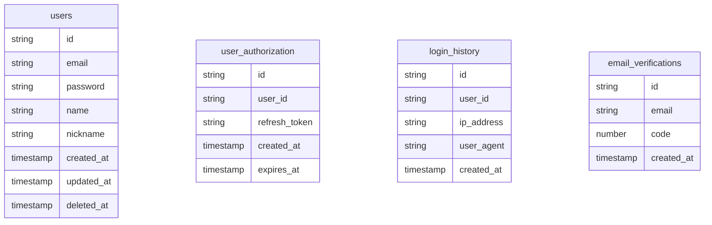

### TODO
- [ ] DB 세팅
- [ ] 스키마 설계
- [ ] 이메일 전송/검증 서비스 ([예시 블로그](https://velog.io/@nickygod/%EC%9D%B4%EB%A9%94%EC%9D%BC-%EC%9D%B8%EC%A6%9D-%EA%B5%AC%ED%98%84%ED%95%98%EA%B8%B0))
- [ ] 이메일 회원가입
- [ ] 인증 (Oauth2.0, 간편 로그인)
- [ ] 티켓 예매
- [ ] 대기열 서비스
- [ ] 생체인증 ([WebAuthn](https://developers.google.com/codelabs/webauthn-reauth?hl=ko#0))

